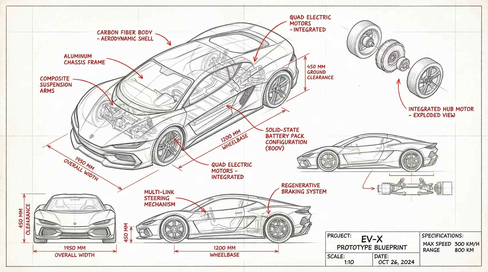
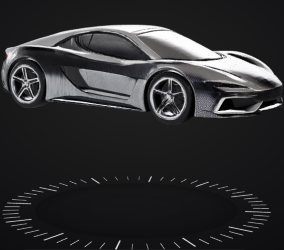

# BlueprintTo3D (图纸转3D)

  
  

  

  🎮 <b><a href="assets/3D_model.glb">点击此处在线 360° 交互预览完整 3D 模型 (GLB 格式)</a></b>

**BlueprintTo3D** 是一个自动化 AI 复合工作流（AI Skill），它能够将复杂的工程图纸、建筑草图、机械结构线稿等，一键转换为干净、真实的 2D 渲染图，并进一步生成高质量的 3D 模型。

本项目专为 OpenClaw 等支持 `SKILL.md` 格式的 AI 助手设计使用。

## 🌟 核心理念与工作流 (The Pipeline)

自动工作流由两个强力的 AI 过程串联完成，支持严格的异步调度，避免 Agent 超时：

1. **第一阶段：清理与实体化 (Clean & Solidify)**
   - **引擎:** Nano Banana Pro (Gemini Image-to-Image)
   - **机制:** 去除图纸中的文字、箭头、尺寸线、网格以及内部透明机械结构，根据外壳比例生成一个高分辨率（2K）、在纯白背景下的超写实 3D 外观 2D 渲染图。
2. **第二阶段：智能抠图与 3D 生成 (Matting & 3D Generation)**
   - **引擎:** Neural4D API
   - **机制:** 自动将第一阶段生成的 2D 图片进行高质量抠图，随后通过 API 发送至 3D 生成集群。生成过程为异步，生成完成后可随时获取。

## 🛠️ 环境依赖 (Prerequisites)

在运行此 Skill 之前，宿主环境需要满足以下基本要求：

- **系统依赖:** `curl`, `jq`, `uv`
- **环境变量:** 
  - `NEURAL4D_API_TOKEN` (用于第二阶段的 Neural4D API 鉴权)
  - `GEMINI_API_KEY` (用于第一阶段 Nano Banana Pro 生成)
- **外部模块:** 请确保上级目录存在配置好的 `nano-banana-pro` 脚本 (`../nano-banana-pro/scripts/generate_image.py`)。

## 🚀 安装与使用教程 (Installation & Usage)

1. 克隆或下载本仓库到本地环境。
2. 将 `SKILL.md` 安装或注册到你的 AI 代理环境（例如 DuckyClaw / OpenClaw）的 `skills/` 目录中。
3. 确保你的环境变量已经配置完毕。
4. **与 AI 交互:**
   - 告诉你的 AI 助手：“请帮我把这张图纸转换成 3D 模型，文件路径是：`C:\path\to\blueprint.png`”。
   - AI 会自动执行**第一阶段**。然后会返回一个确认信息及 `uuid`。
   - 等待几分钟后，你可以输入：“帮我检查一下 `uuid` 的 3D 转换进度”，获取最终的 3D 模型文件。

## 🤝 贡献指南 (Contributing)
如果你对提示词（Prompt）有更好的优化思路，或者希望接入其他更好的 3D 模型转换 API，欢迎提交 Pull Request 或者 Issue 进行讨论！

## 📄 许可证 (License)
本项目采用 [MIT License](LICENSE) 协议进行开源，你可以自由修改、分发及商用。
